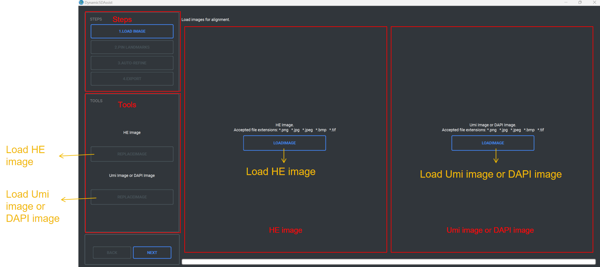
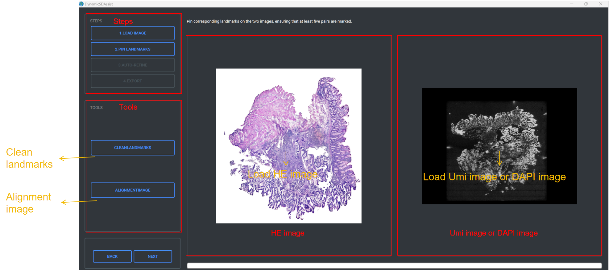
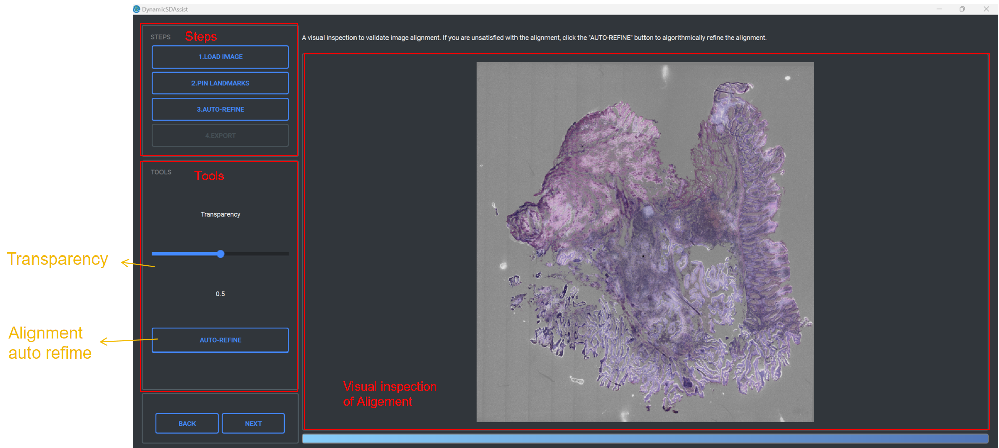
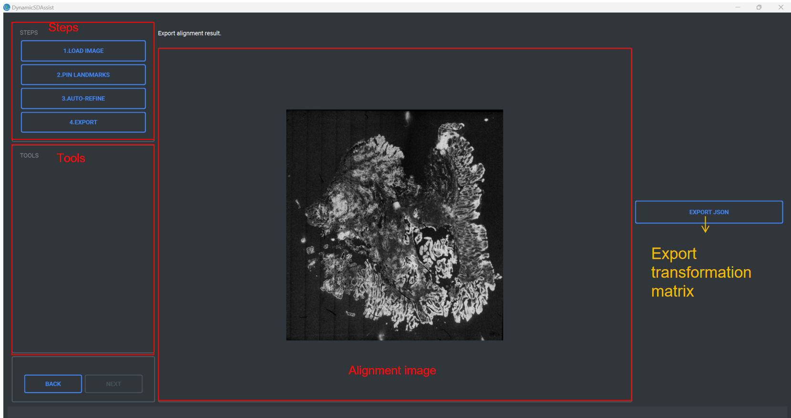
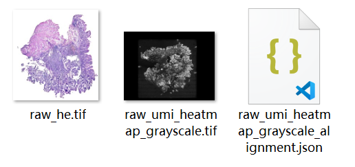

DynamicSD Assist
====

# Introduction

DynamicSD Assist is an interactive software designed to help users manually  align HE images with  umi images or DAPI image.

In this function, the following files are required：

  1.A HE image
  
  2.A umi image or DAPI image

# Installation

Double click the exe shown in the figure to start the installation.

This software is designed to run exclusively on the Windows operating system,  and is not compatible with macOS or Linux.

# Usage

The operation of DynamicSD Assist consists of one part:

1.HE Image and Umi Image or DAPI Image Alignment

During the operation, you can zoom the image by scrolling the mouse wheel or drag the image by pressing the right mouse button.

## Alignment

In this part, you can align the HE image and the umi image or DAPI image.

### Operation process

#### Load Images
STEPS: Display the current step and completed steps.

TOOLS: Replace the HE image and the umi image or DAPI image

1.Click the “LOADIMAGE” button on the left to load the HE image.

2.Click the “LOADIMAGE” button on the right to load the umi image or DAPI image.

3.Click the “REPLACEIMAGE” button on the top of “TOOLS” to replace the HE image.

4.Click the “REPLACEIMAGE” button on the bottom of “TOOLS” to replace the umi image or DAPI image.

5.Click the ”NEXT” button to the Alignment Image step.

 

   
  
#### Alignment Image

STEPS: Display the current step and completed steps.

TOOLS: Align images after pinning landmarks.

1.Pin landmarks on the images by clicking the mouse，and the number of landmarks needs to be greater than 5 pairs.

2.Click the “ALIGNMENTIMAGE” button to align umi image or DAPI image according to landmarks.

3.Click the ”NEXT” button to the Auto Refine step.

  
  
#### Auto Refine

STEPS: Display the current step and completed steps.

TOOLS: Automatically refine the alignment and modify the image transparency.

1.Modify the “Transparency” slider to visually inspect the result of alignment.

2.Click the “AUTO-REFINE” button to automatically fine tune the result of alignment.

3.If the fine-tuning result is unsatisfactory, you can click it for several times until you are satisfied.

4.Click the ”NEXT” button to the Export Alignment Result step.

#### Alignment Result

STEPS: Display the current step and completed steps.

1.Click the ”EXPORT JSON” button to export transformation matrix.

2.In this step, The JSON file will be named as “Umi image or DAPI image name_alignment.JSON”

### Output

The output of this step is the transformation matrix.

